<div align="center">

# 🏫 VLM 教育赋能中枢

### Windows 95 Nostalgia OS Edition · v0.3.0 (Build 1995)

**课堂分析 · 学生自主学习 · 教师能力提升 · 学校治理 —— 四位一体的 VLM 教育赋能平台。**

[](https://react.dev)
[](https://www.typescriptlang.org)
[](https://vitejs.dev)
[](https://tailwindcss.com)
[](https://threejs.org)
[](#-许可证)

[**中文文档**](README.md) · [English](README_EN.md)

</div>

---

## 🕹️ 这是一个什么样的项目？ {#what-is-this-project} · [↗ English](README_EN.md#what-is-this-project)

把时间拨回 1995 年 —— 蓝盈盈的"开始"按钮、凹凸的 3D 窗口边框、能拖来拖去的图标。今天，我们把这套经典的 Win95 桌面操作系统外壳，**重新塞进了一个面向未来的内核**：

> **VLM（Vision-Language Model，视觉语言大模型）驱动的教育赋能中枢 —— 课堂分析 · 学生自主学习 · 教师能力提升 · 学校治理 四位一体。**

传统课堂录播分析往往是这样的"流水线工厂"：

```
音视频输入 → ASR 语音转写 → CV 计算机视觉 → NLP 自然语言处理 → 规则引擎 → 报告
```

每换一个模型就要重新对齐接口，每加一个场景就要写一套规则。**本项目用单颗 VLM 把这条流水线整体替换** —— 你只需要给它"看"一段课堂画面，它就能告诉你：

- 老师讲了什么、写到板书的哪一行
- 谁抬着头、谁在走神
- 实验室里谁违规操作了器材
- 学生此刻的参与度、注意力、教学质量

但这不只是"课堂分析" —— 我们更进一步：**分析之后怎么办？** 答案是为师生提供 **可交互的能力提升工具**：

- 🧑‍🏫 **教师**：进入 Three.js 3D 虚拟教室，面对模拟学生行为进行应对演练，即时脚本反馈与评分
- 🎮 **学生**：基于课堂知识点的互动闯关游戏 —— 限时问答、概念多选、知识连线，让复习变成"打游戏"
- 📖 **知识 WIKI**：交互式力导向知识图谱，拖拽缩放、点击聚焦，AI 助手随问随答

而本阶段（🆕 v0.3.0）我们更进一步 —— 让 AI Agent 从课堂走进**学校治理**：为校长 / 教务 / 年级组长提供专属的**管理岗位**登录入口，**GovernanceProvider**（与 VLMProvider / CapabilityProvider 并列的第三编排器）持续产出治理简报、异常预警与教研建议，数据按 **Raw → Aggregated → Agent Output → Presentation** 四层流向清晰可审计，**AI 消费的数据**与**用户呈现的数据**严格分层。

它不是真的在云端跑大模型 —— 项目内置了一套**预制剧本 + 增量流式 Mock Provider**，让前端体验与真实 VLM 几乎一致；等你接入真实接口时，只需替换 Adapter，无需改动任何业务代码。

---

## ✨ 核心特性 {#core-features} · [↗ English](README_EN.md#core-features)

### 课堂分析

| 模块 | 说明 |
| --- | --- |
| 🏫 **5 大场景演示** | 普通教室 / 体育课 / 实验室 / 实训车间 / 微课录制 |
| 🧠 **解耦的 VLM Harness** | Mock 预制剧本 + 增量流式 + Adapter 预留，可平滑切换真实 VLM |
| 👨‍🏫👩‍🎓 **三角色登录** | 教师 / 学生 / 管理岗位 各自独立的界面与权限 |
| 🎯 **双视角观察** | 教师看"我的学生"，学生看"我的视角" |
| ⏯️ **实时 + 回放双模式** | 边录边分析 / 录后自由拖动时间线 |
| 📋 **分析报告** | 自动汇总指标、改进建议、可打印、可导出 |
| 👤 **画像档案** | 教师多维能力评估雷达图 + 长期趋势 |
| 📝 **我的笔记** | 学生可随手记录课堂重点、收藏知识节点 |

### 能力提升（本阶段新增 🆕）

| 模块 | 说明 |
| --- | --- |
| 📖 **交互式知识 WIKI** | 力导向知识图谱（拖拽/缩放/点击聚焦）+ AI 学习助手随问随答 |
| 🧑‍🏫 **教师虚拟学生演练** | Three.js 3D 低多边形教室，模拟学生举手机/走神/讨论等状态，情境式应对选择 + 即时脚本反馈评分 |
| 🎮 **学生互动闯关** | 限时问答（单选倒计时）/ 概念多选（全对得分）/ 知识连线（配对连线），题目从知识点自动派生，最佳得分持久化 |
| 🔌 **CapabilityProvider 解耦** | 与 VLMProvider 并行的能力接口，Mock→Adapter 切换零业务代码改动 |

### 🏛️ 学校治理（本阶段新增 🆕 v0.3.0）

| 模块 | 说明 |
| --- | --- |
| 📊 **校长驾驶舱** | AI Agent 三区治理视图 —— 左侧数据可视化（综合评分/学期趋势/学科均分/班级排名/教师雷达）+ 中央 Agent 流式治理简报 + 右侧 Agent 对话问答（6 个快捷提问） |
| 🗂️ **教务管理台** | 教师/班级管理 Tab + 一卡通/教务/钉钉/企微 系统集成面板 + SSO/LDAP 配置；底部 Agent 教务洞察给出异常预警 |
| 📈 **年级分析台** | 班级横向对比柱状 + 学科组均分 + 群体分布饼图 + 进步趋势；Agent 年级诊断洞察流式产出短板与建议 |
| 🧠 **GovernanceProvider 编排** | 第三编排器，与 VLMProvider/CapabilityProvider 并列，`streamBriefing` / `streamInsight` 流式 + `detectAnomalies` / `suggestResearch` Promise，Mock→Adapter 切换零业务代码改动 |
| 📑 **四层数据治理** | Raw(AI 消费) → Aggregated(AI+用户共用) → Agent Output(AI 产出) → Presentation(图表/卡片/对话)，数据流向可审计 |

---

## 🖼️ 项目截图 {#screenshots} · [↗ English](README_EN.md#screenshots)

> 所有截图均来自项目实际运行界面，复古的像素感与现代化能力并存 ✨
> 👆 **点击任一截图可查看高清原图**。

---

### 🔬 实验室实时分析 · 显微镜下的酸碱中和滴定

画面左侧是模拟的实验室视频流，右侧是 VLM 正在"识别"出的分析轴 —— 安全准备、操作讲解、操作专注度、知识点命中、学生个体参与度 —— 像不像一个真正的 AI 助教坐在后排听课？

时间线支持 0.5x / 1x / 2x / 4x 倍速回放，每一个事件都标在轴上，鼠标拖一拖就能跳转到任意时刻。

<div align="center">
  <a href="素材/ScreenShot_2026-08-04_102953_447.png" target="_blank">
    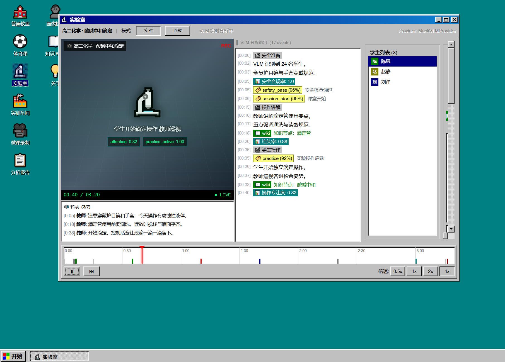
  </a>
  <br/>
  <sub>🔬 图 1 · 实验室场景的实时分析主界面</sub>
</div>

---

### 👤 教师画像档案 · 高中物理高级教师 李建国

多维能力雷达图 + 近 5 节课趋势线，一目了然：

- ✅ **优势维度**：规范性 93% · 教学质量 89%（稳定优秀，可作为示范标杆）
- ⚠️ **短板维度**：互动性 79% · 创新性 77%（建议参加相关教研活动或线上培训）

<div align="center">
  <a href="素材/ScreenShot_2026-08-04_103106_684.png" target="_blank">
    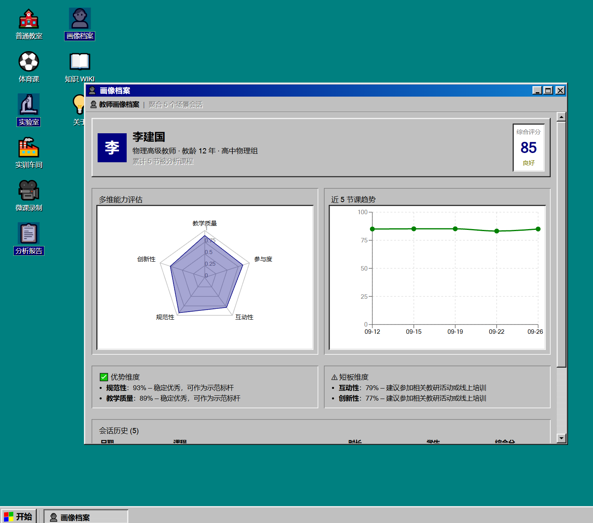
  </a>
  <br/>
  <sub>👤 图 2 · 教师画像档案 · 雷达图 + 趋势线</sub>
</div>

---

### 📋 分析报告 · 高一物理·牛顿第二定律

5 维评分卡 + 教学效果分析 + 学生个体建议（张明、王芳、李伟、赵静……），一键打印、导出归档 —— 教研组评课、青年教师磨课的神器。

<div align="center">
  <a href="素材/wechat_2026-08-04_103048_875.png" target="_blank">
    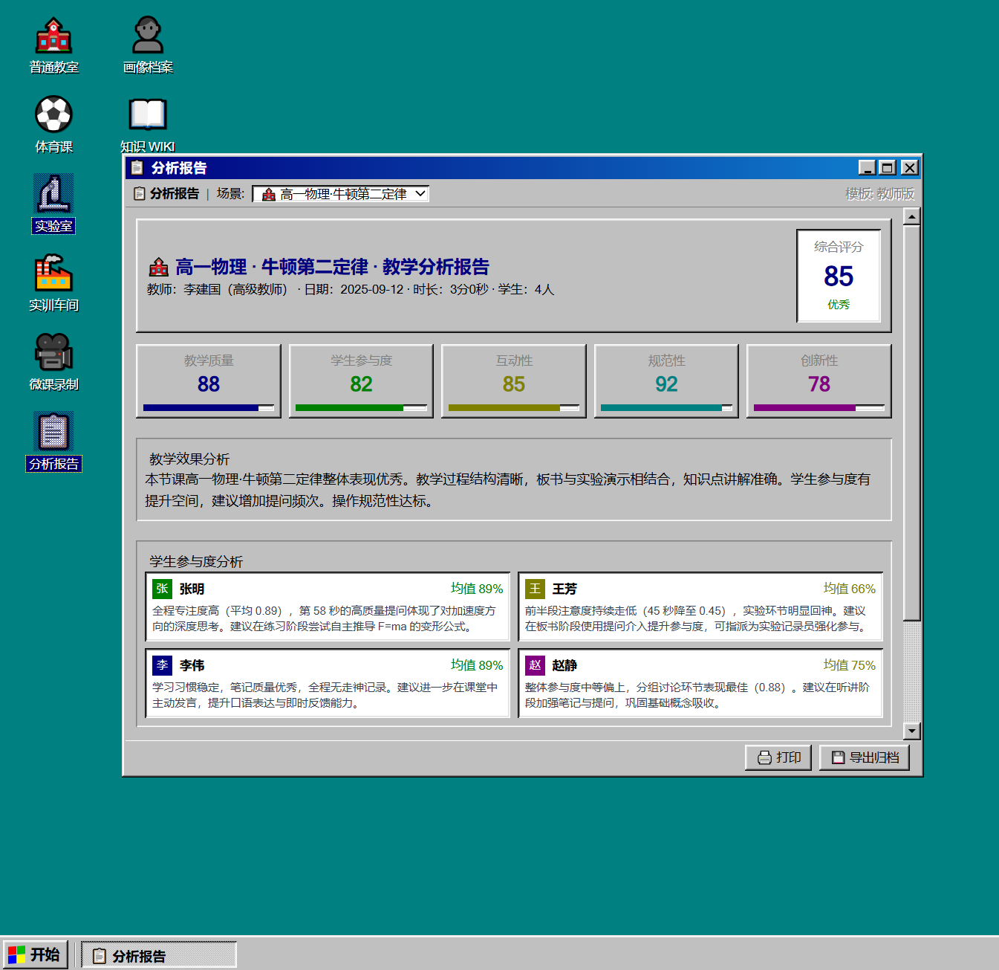
  </a>
  <br/>
  <sub>📋 图 3 · 单节课分析报告 · 5 维评分 + 学生建议</sub>
</div>

---

### 📖 知识 WIKI + AI 学习助手

课堂一结束，VLM 自动抽取出"牛顿第一定律（惯性定律）"的知识节点，包含摘要、详细内容、课堂引用片段、关联知识点、**交互式力导向知识图谱**（拖拽/缩放/点击聚焦）。右侧的 AI 学习助手还能基于上下文回答学生的追问：

> 学生：加速度的方向跟谁相同？
> AI：加速度方向与合外力方向相同，而不是与速度方向相同……

<div align="center">
  <a href="素材/wechat_2026-08-04_103136_163.png" target="_blank">
    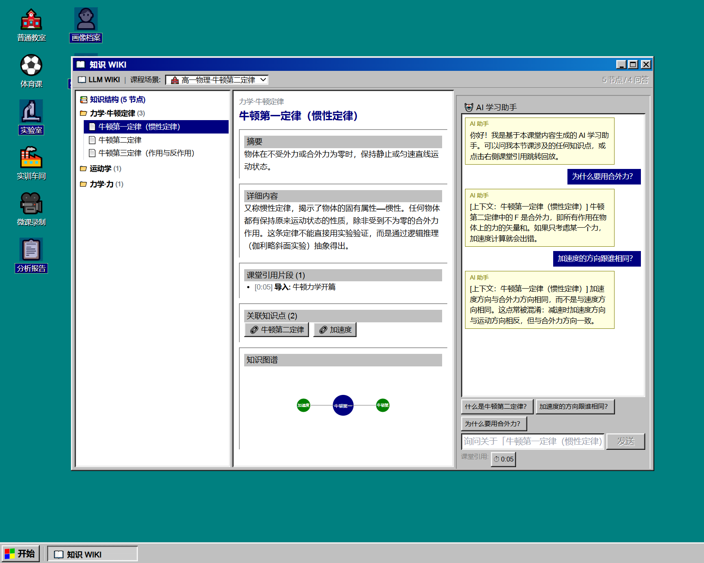
  </a>
  <br/>
  <sub>📖 图 4 · 知识 WIKI 节点详情 + 交互式知识图谱 + AI 学习助手</sub>
</div>

---

### 🧑‍🏫 教师演练 & 🎮 学生闯关（本阶段新增）

**🧑‍🏫 教师虚拟学生演练**（教师角色专属）—— 打开「教师演练」应用后进入 **Three.js 3D 低多边形虚拟教室**：四名按真实座位排布的学生（沿用课堂分析中的角色与颜色），黑板、讲台、课桌一应俱全。点击「下一情境」推进剧本，左侧 3D 场景中相应学生会做出**举手提问 / 走神 / 认真笔记 / 热烈讨论**等状态动作；右侧面板给出该情境下的应对选项，教师选择后立即得到脚本反馈与评分（10 分制 + 评语），用于课后针对性教研。

> 当前情境：学生张明举手提问「加速度方向是不是一定跟力的方向相同？」
> 高分应对：明确指出加速度方向与合外力相同，并举例减速场景。（分值 10）

**🎮 学生互动闯关**（学生角色专属）—— 基于课堂知识点自动派生题目，三种玩法任选：

- **⏱️ 限时问答**：单选倒计时，答对加分、答错扣分，限时逼出真专注
- **☑️ 概念多选**：所有正确选项才得分，覆盖易混淆知识点
- **🔗 知识连线**：左右配对连线，全对过关

最佳得分自动持久化到 LocalStorage，下次进入挑战自己的纪录。

<table align="center">
  <tr>
    <td align="center" width="50%">
      <a href="素材/ScreenShot_2026-08-05_092735_571.png" target="_blank">
        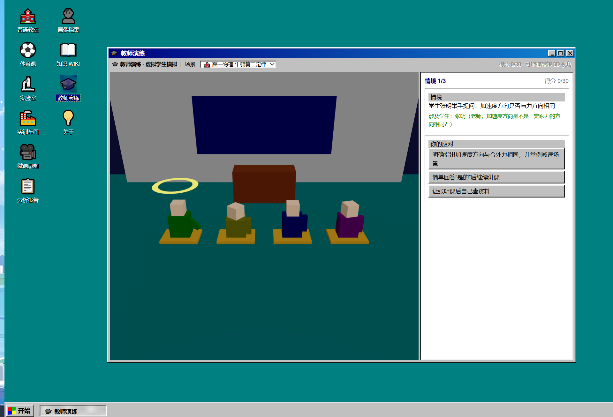
      </a>
      <br/>
      <sub>🧑‍🏫 图 5 · 教师虚拟学生演练 · 3D 教室情境式应对 + 脚本反馈评分</sub>
    </td>
    <td align="center" width="50%">
      <a href="素材/ScreenShot_2026-08-05_092936_648.png" target="_blank">
        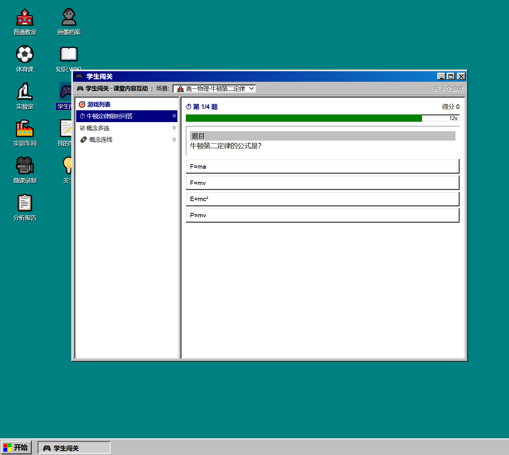
      </a>
      <br/>
      <sub>🎮 图 6 · 学生互动闯关 · 限时问答 / 概念多选 / 知识连线 + 最佳得分持久化</sub>
    </td>
  </tr>
</table>

---

### 📄 教案工具 & 🎬 课件工具（本阶段新增 🆕）

**📄 教案工具**（教师角色专属）—— 打开「教案工具」应用后呈现三栏布局：**左侧多文档列表**（localStorage 独立 key 持久化，新建/删除/标题/学科/课题元数据）· **中间所见即所得 WYSIWYG 编辑器**（自研轻量 Markdown 渲染器 + 块级 `contenteditable`，**直接在预览视图点击修改，无需看 Markdown 源码**；工具栏一键切换标题 H1-H4 / 段落 / 引用 / 有序无序列表 / 代码块 / 表格 / 分割线，行内加粗/斜体/代码/链接通过 `execCommand` 包裹当前选中文本，失焦时用 `htmlToInlineMd` 反序列化为 markdown；上移/下移/删除/插入块级操作齐全）· **右侧生成助手 Agent**（顶部「⚡ 一键生成草稿」按钮按课题流式产出完整教案，下方追问微调如"导入环节怎么设计""例题能否加变式""作业如何分层""时间节奏如何调整"，每条 AI 回答末尾提供「↓ 追加到编辑器」/「⇄ 替换编辑器」一键回填）。

>图中可见「函数单调性判定·教案」已用 WYSIWYG 工具栏撰写为完整章节结构（一/教学目标、二/重难点、三/教学过程含 5 个子节、引用块"提示：求 (ln x)' 的符号"、表格小结），右侧 Agent 正在流式生成同一课题草稿（"AI 助手"消息逐字符浮现），生成完成后可一键替换/追加。

<div align="center">
  <a href="素材/ScreenShot_2026-08-06_170724_904.png" target="_blank">
    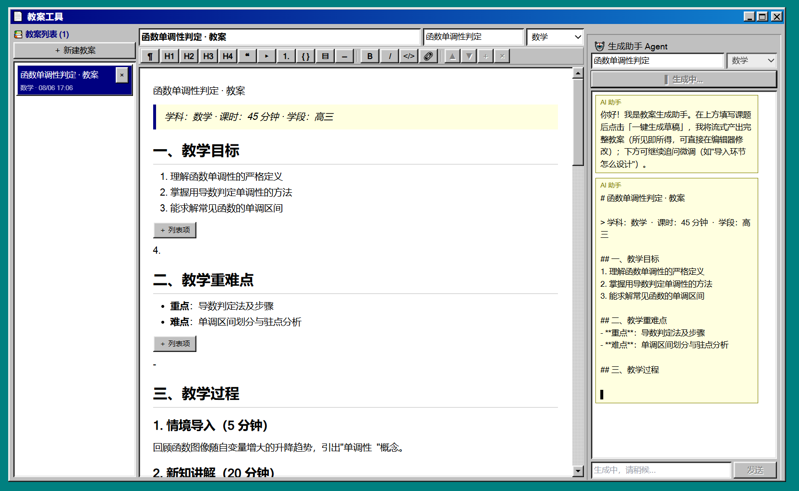
  </a>
  <br/>
  <sub>📄 图 7 · 教案工具 · WYSIWYG 块级所见即所得编辑器 + 工具栏 + 独立 lessonPlan Harness + 流式生成助手</sub>
</div>

---

**🎬 课件工具**（教师角色专属）—— 打开「课件工具」应用后，**核心亮点是 3 套结构差异显著的 design 可切换**（非简单换皮）：

| Design | 字体 / 底色 | 标题装饰 | 列表 / 表格 | **结构差异** |
| --- | --- | --- | --- | --- |
| **📜 经典板书** | 衬线 / 楷体 + 米黄纸张底（带横线纹理） | 双下划线 + 副标题细线 | ▸ 符号 / 双线边框 | 单栏 + 底部页码 |
| **✨ 现代极简** | 无衬线 + 白底居中 | 渐变色块 + 圆点 | 圆点 / 阴影斑马纹 | 居中 + 卡片段落 + 大留白 |
| **📊 图表驱动** | 无衬线 + 暗色 (#0f172a) | 编号 + 左侧色条 | ▸ 蓝色 / 斑马纹 + hover | **双栏（左内容 72% + 右侧栏 28% 进度/页码/本页结构目录）+ 底部进度条** |

>图中 Design 切换器选中"**图表驱动**"（深色高亮），Design 预览区呈现暗色双栏：左侧大字号"单调区间"标题 + 蓝色左色条，右侧"07 / 10"页码徽章 + 渐变进度条 + 本页结构目录（单调区间）+ 底部彩虹进度条；中部编辑区为 WYSIWYG 单页 markdown 编辑（工具栏 + 表格 +＋行/＋列 + 演讲者备注「演示时按 S 键查看」）；右侧生成助手支持"3 套 design 怎么选""增加几张幻灯片""怎样加动画""演讲者备注怎么写"等追问。点击「▶ 演示」进入自定义 React 全屏演示：**←/→/Space** 翻页、**S** 切换演讲者备注、**Esc** 退出、底部进度条实时更新。

<div align="center">
  <a href="素材/ScreenShot_2026-08-06_170816_609.png" target="_blank">
    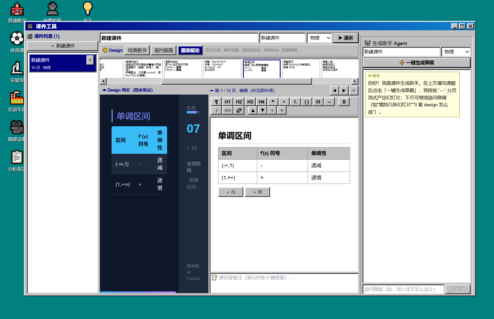
  </a>
  <br/>
  <sub>🎬 图 8 · 课件工具 · Design 切换器（经典板书/现代极简/图表驱动，当前图表驱动）+ Design 预览（暗色双栏 + 进度条）+ WYSIWYG 编辑 + 演讲者备注 + 独立 slides Harness + 生成助手</sub>
</div>

**关键架构：两个工具分别有独立的解耦 Harness**——教案走 `src/harness/lessonPlan/`（types/scripts/MockProvider/adapter/index），课件走 `src/harness/slides/`（同上，含 `designs/` 子目录三套渲染组件），**两个 Harness 物理隔离**，各自自包含注册函数（`getLessonPlanGenProvider` / `getSlidesGenProvider`），不共享类型与状态；接入真实 LLM 时各自在 `adapter.ts` 实现 + `index.ts` 切 `ACTIVE='api'`，**业务代码一行不改**。每套 `design` 是独立 React 组件 + scoped CSS（`sd-classic-` / `sd-modern-` / `sd-dataviz-` 前缀隔离），切换 design 时整套渲染逻辑与样式同步替换——编辑预览与预览模式共用同一组 design 组件，**所见即所演**。

---

### 📝 我的笔记 & 💡 关于本系统

学生可以把课堂重点钉在"置顶"位置，老师可以翻阅系统说明 —— 一切都装在这台像素风"电脑"里。

<table align="center">
  <tr>
    <td align="center" width="50%">
      <a href="素材/ScreenShot_2026-08-04_103334_609.png" target="_blank">
        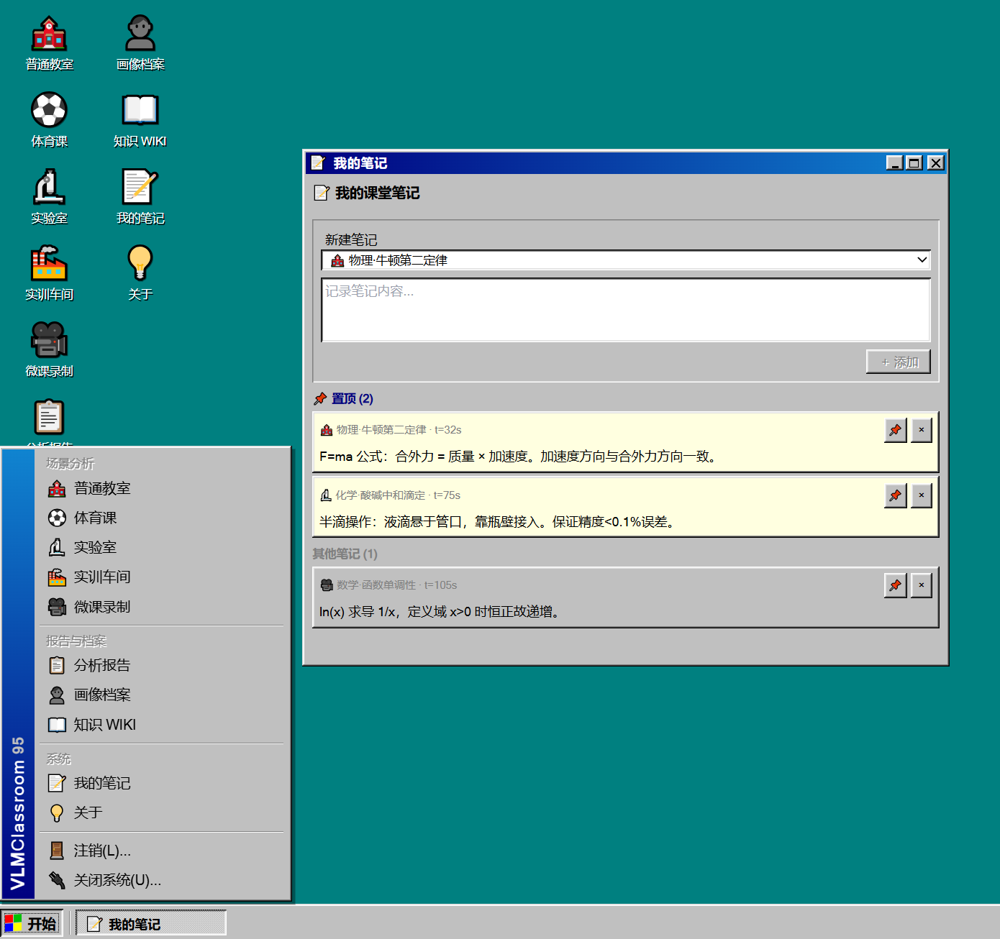
      </a>
      <br/>
      <sub>📝 图 7 · 我的笔记</sub>
    </td>
    <td align="center" width="50%">
      <a href="素材/ScreenShot_2026-08-04_103155_452.png" target="_blank">
        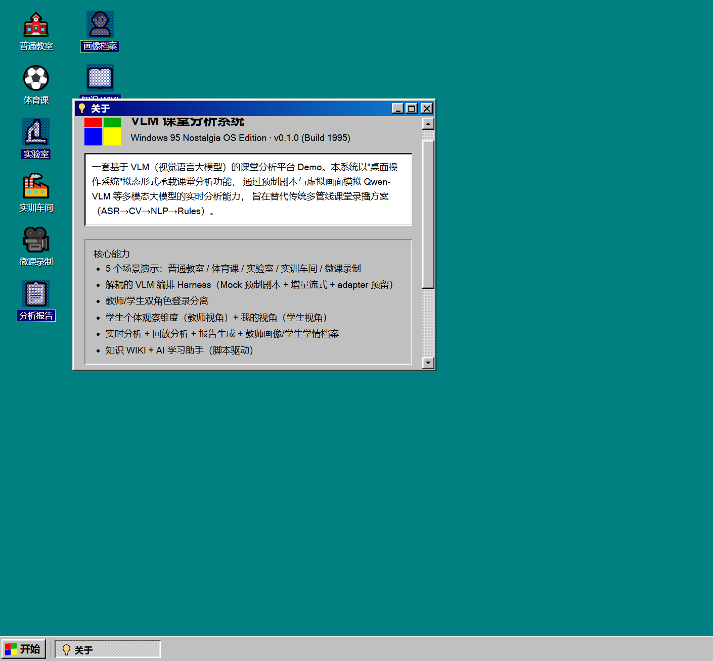
      </a>
      <br/>
      <sub>💡 图 8 · 关于本系统</sub>
    </td>
  </tr>
</table>

---

## 🏛️ AI Agent 学校治理（本阶段新增 🆕）

从「单教师单课堂」到「学校级治理中枢」——本阶段新增**管理岗位**统一视角（涵盖校长、教务主任、年级组长等管理职能，应用内通过视角切换实现差异化），让 AI Agent 从课堂走进校园治理。

**三大架构升级：**

| 升级点 | 说明 |
| --- | --- |
| 🧠 **GovernanceProvider 编排** | 与 VLMProvider / CapabilityProvider 并列的第三个 Provider，提供 `streamBriefing` 流式简报、`streamInsight` 流式对话问答、`detectAnomalies` 异常扫描、`suggestResearch` 教研建议，Mock 规则引擎 + Adapter 预留接入真实 LLM |
| 📊 **数据四层分层治理** | Layer1 Raw（AI 消费，不渲染）→ Layer2 Aggregated（AI+用户共用）→ Layer3 Agent Output（AI 产出，用户消费）→ Layer4 Presentation（图表/卡片/对话）—— 数据流向清晰可审计 |
| 🪟 **三区 AI Agent 界面范式** | 左侧数据图表 + 中间 Agent 流式简报 + 右侧 Agent 对话问答，洞察与可视化联动 |

### 📊 校长驾驶舱 · AI Agent 治理三区布局

打开「校长驾驶舱」后，呈现典型的 AI Agent 治理视图 —— **不是冷冰冰的看板，而是一位坐在你旁边的 AI 副校长**：

- 📈 **左侧数据可视化区**：综合评分、学期环比、分析覆盖率、活跃教师/班级 5 张概览卡片；下方依次是学期趋势折线、学科均分对比、班级综合排名、教师能力雷达
- 💡 **中央 Agent 治理简报**（AI 流式逐块产出）：自动总结「本期教学综合评分 86%，环比 +1.6%」「课堂分析覆盖率 65%，活跃教师 5 名」「整体稳步上升」「高一·三班需关注互动性下滑」「高二·三班待提升」等洞察，**预警项以红色高亮**，可下钻到具体数据
- 💬 **右侧治理 Agent 对话**：内置「全校教学质量趋势」「班级排名对比」「哪个教师需要帮扶」「学科分析」「异常预警」「教研建议」6 个快捷提问，可自由追问；Agent 引用真实数据作答，并联动左侧图表高亮

<div align="center">
  <a href="素材/ScreenShot_2026-08-05_142920_397.png" target="_blank">
    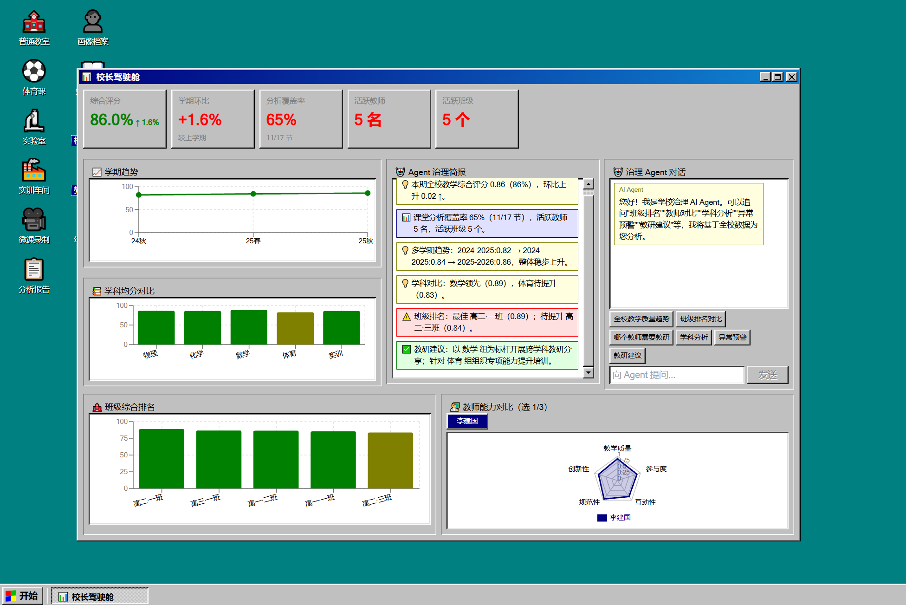
  </a>
  <br/>
  <sub>📊 图 9 · 校长驾驶舱 · 治理简报流 + 数据可视化 + Agent 对话问答，三区联动</sub>
</div>

---

### 🗂️ 教务管理台 · 系统集成与 SSO 配置

打开「教务管理台」并切到「**系统集成**」Tab：四个集成系统卡片清晰呈现状态 —— ✅ 一卡通系统（已连接，最近同步 2025-12-04 08:30，同步记录 1280 条）/ ✅ 教务系统（已连接，1286 条）/ 🔄 钉钉（同步中，240 条）/ ❌ 企业微信（未连接）。下方同步日志按时间倒序展示每一次握手，底部「Agent 教务洞察」给出异常预警与建议。

> 该视图向学校决策者**演示了未来对接一卡通 / 教务 / 钉钉 / 企微 / LDAP / SSO 的真实路径** —— 数据走向、连接状态、同步频率、异常告警一目了然，是采购决策时最关心的「可集成性」可视化证据。

<div align="center">
  <a href="素材/ScreenShot_2026-08-05_142951_250.png" target="_blank">
    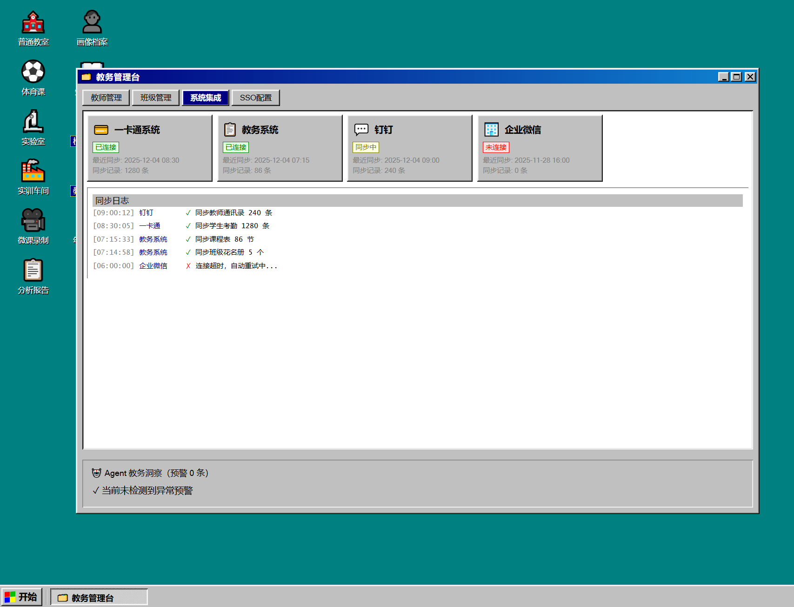
  </a>
  <br/>
  <sub>🗂️ 图 10 · 教务管理台 · 系统集成 Tab · 4 套业务系统连接状态 + 同步日志 + Agent 异常预警</sub>
</div>

---

## 🏗️ 架构 {#architecture} · [↗ English](README_EN.md#architecture)

```
┌──────────────────────────────────────────────────────────┐
│  Shell 层（Win95 拟态桌面 · 三角色登录）                     │
│  BootScreen · LoginDialog · Desktop · Window · Taskbar    │
│  🆕 SSO 模拟认证进度对话框 · 管理岗位入口                   │
└──────────────────────────────────────────────────────────┘
                            ↓
┌──────────────────────────────────────────────────────────┐
│  Apps 层                                                   │
│  ┌──────────────┬───────────────┬──────────────────────┐ │
│  │ 课堂分析       │ 能力提升（🆕）  │ 学校治理（🆕 v0.3.0）│ │
│  │ 5场景+报告+画像│ WIKI+演练+游戏│ 驾驶舱+教务+年级    │ │
│  └──────────────┴───────────────┴──────────────────────┘ │
└──────────────────────────────────────────────────────────┘
                            ↓
┌──────────────────────────────────────────────────────────┐
│  Harness 层（四 Provider 编排）                              │
│  VLMProvider · CapabilityProvider（🆕）· GovernanceProvider │
│  · PortalProvider（🆕 v0.3.0）                              │
│  Mock 规则引擎 × 4 · Adapter 预留真实 API × 4                │
└──────────────────────────────────────────────────────────┘
                            ↓
┌──────────────────────────────────────────────────────────┐
│  Data 层（LocalStorage 持久化 · StorageSchema v1→v2 渐进迁移）│
│  🆕 组织架构：学校/学期/年级/班级/学科实体                   │
│  🆕 多学期多教师多班级真实感种子数据（约 36 条）               │
└──────────────────────────────────────────────────────────┘
```

**关键设计理念**：Harness 层与 Apps 层完全解耦。`VLMProvider` 负责流式课堂分析，`CapabilityProvider`（🆕）负责知识 WIKI / 虚拟演练 / 互动游戏的取数，`GovernanceProvider`（🆕 v0.3.0）负责管理岗位的治理简报 / 对话问答 / 异常预警 / 教研建议，`PortalProvider`（🆕 v0.3.0）负责登录后默认门户的 AI Agent 检索导航与角色级快捷入口，`LessonPlanGenProvider`（🆕）负责教案草稿流式生成与微调，`SlidesGenProvider`（🆕）负责课件（3 套 design）草稿流式生成与微调——后两者**物理隔离**为 `harness/lessonPlan/` 与 `harness/slides/` 子目录（含 `designs/` 三套独立渲染组件），各自自包含注册函数 `getLessonPlanGenProvider` / `getSlidesGenProvider`；治理数据按 **Raw → Aggregated → Agent Output → Presentation** 四层分层治理，**AI 消费的数据**与**用户呈现的数据**严格分离。今天用 Mock 跑预制剧本，明天换成 Adapter 调真实 API —— **业务代码一行不改**。

---

## 🚀 本地运行 {#run-locally} · [↗ English](README_EN.md#run-locally)

```bash
# 1. 安装依赖
npm install

# 2. 启动开发服务器
npm run dev
# → 浏览器打开 http://localhost:5173

# 3. 构建生产版本
npm run build

# 4. 预览构建产物
npm run preview
```

进入系统后会依次看到：

1. 🖥️ **BootScreen** —— 蓝白渐变的开机引导
2. 🔐 **LoginDialog** —— 选择「教师登录」/「学生登录」/「管理岗位登录」（🆕 含 SSO 模拟认证进度对话框）
3. 🪟 **Desktop** —— 桌面图标 + 开始菜单 + 任务栏（教师/学生/管理岗位看到不同应用，**管理岗位进入「学校治理」分组**）
4. 🚪 **PortalApp** —— 登录后默认弹出的角色自适应管理门户（顶部 AI Agent 检索导航直达功能/数据）
5. 🎯 双击图标打开任意 App 窗口

---

## 🔌 接入真实 VLM / LLM API {#api-integration} · [↗ English](README_EN.md#api-integration)

本项目开箱即用一套**预制剧本 + 增量流式 Mock Provider**，前端体验与真实 VLM 几乎一致。当你准备好接入真实模型 API（OpenAI GPT-4o / 通义千问 Qwen-VL / 本地 vLLM 部署等）时，**业务代码一行不改** —— 只需实现预留的 Adapter 骨架，再在注册中心切换一个常量。

📖 **完整接入指南**：[API_INTEGRATION_GUIDE.md](API_INTEGRATION_GUIDE.md)（中文） · [API_INTEGRATION_GUIDE_EN.md](API_INTEGRATION_GUIDE_EN.md)（English）

指南涵盖：6 个 Provider 的接口契约与 Adapter 位置、VLM 与 LLM 的区别与场景、环境变量与后端代理配置、SSE 流式解析工具、端到端 OpenAIAdapter 完整实现示例、安全注意事项与常见问题。

---

## 🧩 技术栈 {#tech-stack} · [↗ English](README_EN.md#tech-stack)

| 类别 | 选型 |
| --- | --- |
| 框架 | React 18 + TypeScript 5 |
| 构建 | Vite 5 |
| 样式 | Tailwind CSS 3 + 自研 Win95 组件样式（`.win-text` / `.win-sunken` / `.win-fieldset`） |
| 3D 渲染 🆕 | Three.js r169 + @react-three/fiber v8 + @react-three/drei v9 |
| 状态 | Zustand（auth / session / profile / wiki / game / window / 🆕 org / 🆕 governance / 🆕 portal 多 Store 分治） |
| 图标 | lucide-react + react-icons |
| 图表 | recharts（雷达图 / 折线图） |
| 持久化 | 浏览器 LocalStorage（开箱即用、无需后端） |

---

## 🗂️ 目录结构 {#project-layout} · [↗ English](README_EN.md#project-layout)

```
src/
├── shell/           # Win95 拟态：桌面、窗口、任务栏、登录、开机
├── apps/            # 业务应用
│   ├── scenarios/   # 五大场景：classroom / pe / lab / workshop / microlesson
│   ├── drill/       # 🆕 教师演练：VirtualStudent · Classroom3DScene · DrillController
│   ├── games/       # 🆕 学生游戏：TimedQA · MatchGame · ConnectionGame
│   ├── ReportApp.tsx
│   ├── ProfileApp.tsx
│   ├── WikiApp.tsx
│   ├── NotesApp.tsx
│   ├── AboutApp.tsx
│   ├── TeacherDrillApp.tsx  # 🆕 教师演练 App 外壳
│   ├── LearningGameApp.tsx  # 🆕 学生闯关 App 外壳
│   ├── DashboardApp.tsx     # 🆕 v0.3.0 校长驾驶舱 · AI Agent 三区布局
│   ├── AdminConsoleApp.tsx  # 🆕 v0.3.0 教务管理台 · 教师/班级/集成/SSO
│   ├── GradeAnalysisApp.tsx # 🆕 v0.3.0 年级分析台 · 班级/学科/群体对比
│   ├── PortalApp.tsx        # 🆕 v0.3.0 角色自适应管理门户（登录后默认弹出 · AI Agent 检索导航）
│   ├── registry.ts          # 应用注册 + AppCategory 分类（🆕 governance 类别）
│   └── launcher.tsx         # 懒加载分发（🆕 治理应用 chunk）
├── components/      # 复用组件
│   ├── KnowledgeGraph.tsx  # 🆕 交互式力导向知识图谱
│   ├── Timeline.tsx · StudentTimeline.tsx · RadarChart.tsx · TrendChart.tsx
│   ├── StatCard.tsx · BarChart.tsx · MultiRadarChart.tsx · PieChart.tsx  # 🆕 v0.3.0
│   ├── AgentInsightStream.tsx · GovernanceChat.tsx  # 🆕 v0.3.0 Agent 流式组件
│   ├── TypingStream.tsx · ChatAssistant.tsx
│   └── WikiTree.tsx
├── harness/         # 编排层（六 Provider）
│   ├── types.ts             # VLMProvider + 🆕 CapabilityProvider + 🆕 GovernanceProvider + 🆕 PortalProvider + 🆕 LessonPlanGenProvider + 🆕 SlidesGenProvider
│   ├── MockVLMProvider.ts · MockCapabilityProvider.ts
│   ├── MockGovernanceProvider.ts · MockPortalProvider.ts
│   ├── lessonPlan/          # 🆕 教案独立 Harness（物理隔离）
│   │   ├── types.ts · scripts.ts · MockProvider.ts · adapter.ts · index.ts
│   ├── slides/              # 🆕 课件独立 Harness（含 3 套 design）
│   │   ├── types.ts · scripts.ts · MockProvider.ts · adapter.ts · index.ts
│   │   └── designs/         # 🆕 3 套结构差异 design（classic/modern/dataviz）
│   │       └── classic.tsx · modern.tsx · dataviz.tsx · index.tsx
│   ├── providerRegistry.ts  # 四 Provider 统一注册 + 切换
│   ├── adapters/            # 真实模型 API 桩（OpenAI / Qwen / VLLM + 🆕 CapabilityAdapter + 🆕 GovernanceAdapter + 🆕 PortalAdapter + 🆕 LessonPlanGenAdapter + 🆕 SlidesGenAdapter）
│   └── scripts/             # 预制剧本（classroom.json 含 🆕 simulation + games 数据）
├── stores/          # Zustand 状态管理
│   ├── gameStore.ts         # 🆕 游戏最佳得分持久化
│   ├── orgStore.ts          # 🆕 v0.3.0 组织架构（学校/学期/年级/班级/学科）
│   ├── governanceStore.ts   # 🆕 v0.3.0 治理聚合计算（Layer2 Aggregated）
│   ├── wikiStore.ts · authStore.ts · sessionStore.ts · ...
├── data/            # 种子数据 + LocalStorage 持久化
├── theme/           # Win95 主题样式
├── App.tsx
└── main.tsx
```

---

## 📜 许可证 {#license} · [↗ English](README_EN.md#license)

本项目采用 **[Creative Commons 署名-非商业性使用 4.0 国际 (CC BY-NC 4.0)](https://creativecommons.org/licenses/by-nc/4.0/deed.zh)** 协议发布。

你可以自由地：

- ✅ **分享** — 复制、发行、传播本作品
- ✅ **改编** — 修改、转换、二次创作

但必须遵守以下条款：

- 📛 **署名** — 你必须给出适当的署名，提供指向本项目主页与原作者的链接，同时标明是否做了修改
- 🚫 **禁止商用** — 你不得将本作品用于任何商业目的（包括但不限于：销售、付费服务、商业培训、商业产品集成、广告变现等）

> 简言之：**想转载、二创、教学使用？欢迎，但请署上原作者与项目地址；想拿去做生意？没门。**

完整法律文本请参见 [LICENSE](LICENSE) 文件。

---

## 🙏 致谢 {#acknowledgments} · [↗ English](README_EN.md#acknowledgments)

- 致敬 **Microsoft Windows 95** —— 一个定义了"个人电脑桌面"的伟大产品
- 致敬所有开源的 **VLM / Qwen-VL / GPT-4V** —— 让"让 AI 看懂世界"成为可能
- 致敬 **OpenMAIC（THU-MAIC）** —— 深度交互形态（3D 可视化 / 游戏化学习）的灵感来源
- 致敬像素艺术、致敬复古 UI、致敬所有让软件重新变得有趣的人

---

<div align="center">

**Made with ❤️ and a floppy disk · © 1995-2026 VLM Edu Hub Inc.**

*本仓库为演示项目，所有学生/教师姓名、课堂数据均为虚构。*

</div>
