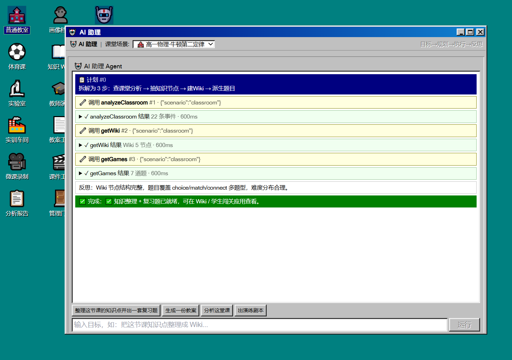

<div align="center">

# 🏫 VLM Edu Hub

### Windows 95 Nostalgia OS Edition · v0.4.0 (Build 1995)

**Classroom Analysis · Student Self-Learning · Teacher Capability Uplift · School Governance · AI Native Agent — a five-in-one education empowerment hub powered by VLM.**

[](https://react.dev)
[](https://www.typescriptlang.org)
[](https://vitejs.dev)
[](https://tailwindcss.com)
[](https://threejs.org)
[](#-license)

[中文文档](README.md) · **English**

</div>

---

## 🕹️ What Is This Project? {#what-is-this-project} · [↗ 中文](README.md#what-is-this-project)

Let's roll the clock back to 1995 — the teal "Start" button, the chunky 3D window borders, draggable icons everywhere. Today, we've stuffed a **future-proof brain** into that classic Win95 desktop shell:

> **An education empowerment hub powered by VLM (Vision-Language Models) — classroom analysis · student self-learning · teacher capability uplift · school governance, all in one.**

A traditional lecture-recording pipeline usually looks like this:

```
audio + video → ASR speech-to-text → CV computer vision → NLP → rules engine → report
```

Every time you swap a model you re-align interfaces. Every new scenario you re-write rules. **This project replaces the entire pipeline with a single VLM** — just let it "watch" the classroom, and it will tell you:

- What the teacher said, which line of the board they wrote on
- Who's paying attention, who's zoning out
- Who mishandled equipment in the lab
- Each student's current engagement, attention, and teaching-quality scores

But we go beyond analysis — **what happens after?** The answer: **interactive capability-building tools** for both teachers and students:

- 🧑‍🏫 **For Teachers**: Step into a Three.js 3D virtual classroom and practice responding to simulated student behaviors with instant scripted feedback and scoring
- 🎮 **For Students**: Interactive quiz games built from classroom knowledge — timed Q&A, multi-select, concept-matching — turning review into play
- 📖 **Knowledge WIKI**: An interactive force-directed knowledge graph (drag, zoom, click-to-focus) with an AI study assistant at your side

And this phase (🆕 v0.3.0) goes one step further — letting the AI Agent step out of the classroom and into **school governance**: a dedicated **management-role** login for principals / academic affairs / grade heads, a **GovernanceProvider** (the third orchestrator alongside VLMProvider / CapabilityProvider) continuously producing governance briefings, anomaly alerts and teaching-research suggestions, with data flowing through **Raw → Aggregated → Agent Output → Presentation** in four clearly auditable layers — **data consumed by AI** and **data shown to users** are strictly separated.

The latest release (🆕 v0.4.0) — **AI Native Upgrade** — propels the project from an "AI-enhanced app" into the "AI Agent product" camp: a new **Agent orchestration kernel** (Plan→Act→Reflect loop, native function-calling first + Plan-JSON fallback), **Wiki assistant wired to a real LLM** (streamChatCompletion + node context), a **RAG knowledge base** (Embedding + BM25 fallback, transparent injection at three points), **true multimodal VLM** (image upload + image_url injection + 5 photorealistic classroom images for Mock recognition), and an **AI output quality-evaluation closed loop** (rules + LLM dual-channel + trend tracking). All new capabilities ship with Mock fallbacks — **8 Providers each independently switchable between mock↔api** — so the full flow is demonstrable offline, and wiring real APIs requires zero business-code changes.

It isn't actually running a giant model in the cloud — the project ships a **pre-scripted Mock Provider with incremental streaming** so the front-end feels just like a real VLM. When you're ready to wire up a real backend, you only swap the Adapter; **no business code needs to change**.

---

## ✨ Core Features {#core-features} · [↗ 中文](README.md#core-features)

### Classroom Analysis

| Module | Description |
| --- | --- |
| 🏫 **5 Scenario Demos** | Regular Classroom / PE Class / Chemistry Lab / Vocational Workshop / Micro-lesson Recording |
| 🧠 **Decoupled VLM Harness** | Mock scripts + incremental streaming + Adapter slot — seamlessly switch to a real VLM |
| 👨‍🏫👩‍🎓 **Three-Role Login** | Separate interfaces and permissions for teachers, students, and management roles |
| 🎯 **Two Observational Views** | Teachers see "my students"; students see "my own view" |
| ⏯️ **Live + Replay Modes** | Analyze in real time, or scrub the timeline afterwards at any speed |
| 📋 **Analysis Reports** | Auto-aggregated metrics, improvement suggestions, printable & exportable |
| 👤 **Profile Archives** | Multi-dimensional teacher radar charts + long-term trend lines |
| 📝 **My Notes** | Students can jot down highlights and pin knowledge nodes |

### Capability Building (New 🆕)

| Module | Description |
| --- | --- |
| 📖 **Interactive Knowledge WIKI** | Force-directed knowledge graph (drag/zoom/click-focus) + AI study assistant Q&A |
| 🧑‍🏫 **Teacher Virtual Student Drill** | Three.js low-poly 3D classroom with simulated students (raising hand / zoning out / taking notes / discussing); scenario-based response selection with instant scripted scoring |
| 🎮 **Student Interactive Games** | Timed Q&A (single-choice countdown) / Concept multi-select / Knowledge connection (pair-matching) — all derived from knowledge nodes, with best-score persistence |
| 🔌 **CapabilityProvider Decoupling** | A parallel capability interface alongside VLMProvider — Mock→Adapter swap with zero business-code changes |
| 📄 **Lesson Plan Tool 🆕** | A self-developed WYSIWYG Markdown editor (block-level `contenteditable` + full toolbar: headings/lists/quote/table/code/hr + inline bold/italic/code/link) + isolated `lessonPlan` Harness + streaming Gen Assistant (one-click draft + chat refinement + insert-into-editor) |
| 🎬 **Slides Deck Tool 🆕** | 3 structurally-distinct designs (Classic Blackboard / Modern Minimalist / DataViz — DataViz is dark two-column with progress bar, not just skin-swap) + isolated `slides` Harness (with `designs/` subfolder) + WYSIWYG per-slide editor + custom React presentation mode (keyboard paging / progress / speaker notes) |

### 🏛️ School Governance (New 🆕 v0.3.0)

| Module | Description |
| --- | --- |
| 📊 **Principal Cockpit** | AI Agent three-zone governance view — left data visualization (composite score / semester trend / subject averages / class ranking / teacher radar) + center Agent streaming briefing + right Agent Q&A (6 quick prompts) |
| 🗂️ **Academic Affairs Console** | Teacher/Class management tabs + Campus Card / Academic Affairs / DingTalk / WeCom integration panel + SSO/LDAP config; bottom Agent insight surfaces anomaly alerts |
| 📈 **Grade Analysis Console** | Class comparison bars + subject-group averages + group distribution pie + progress trend; Agent streams grade-level diagnosis of weak points and suggestions |
| 🧠 **GovernanceProvider Orchestration** | Third orchestrator alongside VLMProvider/CapabilityProvider — `streamBriefing` / `streamInsight` streaming + `detectAnomalies` / `suggestResearch` promises; Mock→Adapter swap with zero business-code changes |
| 📑 **Four-Layer Data Governance** | Raw (AI consumed) → Aggregated (AI+user shared) → Agent Output (AI produced) → Presentation (charts/cards/chat); data flow is fully auditable |

### 🤖 AI Native Upgrade (New 🆕 v0.4.0)

| Module | Description |
| --- | --- |
| 🧠 **Agent Orchestration Kernel** | Plan→Act→Reflect loop, **native function-calling first** (OpenAI-compatible `tools` field, supports parallel calls) + **Plan-JSON self-parse fallback** (auto-parses `{steps:[{tool,args}]}` when the model lacks tools support); 7 tools wrap existing Providers; MockOrchestrator ships 4 canned task walkthroughs |
| 💬 **Wiki Assistant on Real LLM** | ChatAssistant dual-mode: useLLM streams via streamChatCompletion with current-node details + related-node summaries + last-10-turn history; auto-falls back to keyword matching on failure (zero blocking); RAG retrieval auto-injected into the system prompt |
| 📚 **RAG Knowledge Base** | In-browser vector store (Embedder + VectorStore + Indexer + Retriever), **transparent injection at three points**: Wiki answers / lesson-plan generation / governance Q&A; MockRetriever uses BM25 keyword approximation as fallback; generated content is auto-indexed for future retrieval |
| 🖼️ **True Multimodal VLM** | FrameSample gains an `imageData` field; OpenAIAdapter auto-injects up to 8 `image_url` frames; ScenarioApp image-upload UI (base64 + 5MB cap); **5 photorealistic classroom images** (`素材/mock-*.png`) + MockImageResolver fingerprint matching — uploading a known image auto-produces "image recognition summary" chunk prefixes (honestly tagged `confidence: 0`) |
| 🔍 **AI Output Quality-Eval Closed Loop** | Rules + LLM dual-channel Evaluator (5 object types: lesson plan / slides / Wiki / quiz / governance briefing); EvalPanel shows composite score / dimension scores / issue list / quality-trend bar chart; FeedbackBar collects user feedback into the MemoryStore preferences; sub-par results prompt regeneration |
| 🔌 **8 Independently-Switchable Providers** | vlm / capability / governance / portal / lessonPlan / slides / **agent** (🆕) / **rag** (🆕) each switch mock↔api independently — you can wire only part and keep the rest on Mock; managed via the unified API config panel |

---

## 🖼️ Screenshots {#screenshots} · [↗ 中文](README.md#screenshots)

> All screenshots are real captures from the running app — pixel-art nostalgia meets modern AI capability ✨
> 👆 **Click any screenshot to view the full-resolution original.**

---

### 🤖 AI Native Upgrade Overview · v0.4.0

This release propels the project from an "AI-enhanced app" into an "AI Agent product" — one picture shows the four big upgrades: **Agent orchestration kernel** (Plan→Act→Reflect loop), **Wiki on real LLM**, **RAG knowledge base**, **multimodal VLM**, and the **quality-eval closed loop**. All new capabilities ship with Mock fallbacks; 8 Providers each switch independently between mock↔api.

<div align="center">
  <a href="素材/1.png" target="_blank">
    
  </a>
  <br/>
  <sub>🤖 Fig. 1 · AI Native Upgrade Overview · Agent orchestration + Wiki LLM + RAG knowledge base + multimodal VLM + quality-eval closed loop</sub>
</div>

---

### 🔬 Lab Live Analysis · Acid-Base Titration Under the Microscope

On the left is the simulated lab video feed; on the right is the VLM's "perception" axis — safety prep, instruction delivery, operation focus, knowledge-node hits, per-student engagement. Looks just like a real AI teaching assistant sitting in the back row.

The timeline supports 0.5x / 1x / 2x / 4x playback, with every event pinned to the axis. Drag the cursor to jump anywhere.

<div align="center">
  <a href="素材/ScreenShot_2026-08-04_102953_447.png" target="_blank">
    
  </a>
  <br/>
  <sub>🔬 Fig. 1 · Lab scenario real-time analysis main view</sub>
</div>

---

### 👤 Teacher Profile · Mr. Jianguo Li, Senior Physics Teacher

A glance tells the whole story: multi-dimensional radar + 5-class trend line.

- ✅ **Strengths**: Standardization 93% · Teaching Quality 89% (stable excellence, demo-worthy)
- ⚠️ **Areas to grow**: Interactivity 79% · Innovation 77% (suggest joining teaching-research groups or online training)

<div align="center">
  <a href="素材/ScreenShot_2026-08-04_103106_684.png" target="_blank">
    
  </a>
  <br/>
  <sub>👤 Fig. 2 · Teacher profile · radar chart + trend line</sub>
</div>

---

### 📋 Analysis Report · Grade-10 Physics · Newton's Second Law

A 5-dimension scorecard + teaching-effectiveness summary + per-student suggestions (Zhang Ming, Wang Fang, Li Wei, Zhao Jing…). One-click print and archive — a perfect companion for lesson-study groups and young teachers.

<div align="center">
  <a href="素材/wechat_2026-08-04_103048_875.png" target="_blank">
    
  </a>
  <br/>
  <sub>📋 Fig. 3 · Single-class report · 5-dim scores + student suggestions</sub>
</div>

---

### 📖 Knowledge WIKI + AI Study Assistant

As soon as the class ends, the VLM auto-extracts the full knowledge node — abstract, detailed content, classroom citations, related nodes, plus an **interactive force-directed knowledge graph** (drag/zoom/click-focus). The AI assistant on the right answers follow-up questions using that exact context:

> Student: Which direction does acceleration match?
> AI: Acceleration points in the same direction as the net force, not the velocity direction …

<div align="center">
  <a href="素材/wechat_2026-08-04_103136_163.png" target="_blank">
    
  </a>
  <br/>
  <sub>📖 Fig. 4 · Knowledge WIKI detail + interactive graph + AI study assistant</sub>
</div>

---

### 🧑‍🏫 Teacher Drill & 🎮 Student Games (New)

**🧑‍🏫 Teacher Virtual Student Drill** (teacher-exclusive) — Launch the "Teacher Drill" app and step into a **Three.js low-poly 3D virtual classroom**: four students arranged at real desks (same colors and roles as in classroom analysis), with chalkboard, podium, and desks in place. Advance the script via "Next Situation"; the involved student in the 3D scene performs the scripted state — **raising hand to ask / zoning out / taking notes / actively discussing**. The right panel offers response options; pick one and you instantly get scripted feedback + score (10-point scale + commentary) for targeted post-class reflection.

> Current situation: Zhang Ming raises hand — "Does acceleration always point in the same direction as force?"
> Top-scoring response: Clearly state that acceleration points in the same direction as the net force, and give a deceleration example. (Score 10)

**🎮 Student Interactive Games** (student-exclusive) — Questions are auto-derived from classroom knowledge nodes across three game modes:

- **⏱️ Timed Q&A**: single-choice with countdown — right answers earn points, wrong ones deduct; the timer forces real focus
- **☑️ Concept Multi-Select**: all correct options must be chosen for points — surfaces commonly confused concepts
- **🔗 Knowledge Connection**: pair-match left and right items; full-match to pass

Best scores are auto-persisted to LocalStorage — come back to beat your own record.

<table align="center">
  <tr>
    <td align="center" width="50%">
      <a href="素材/ScreenShot_2026-08-05_092735_571.png" target="_blank">
        
      </a>
      <br/>
      <sub>🧑‍🏫 Fig. 5 · Teacher Virtual Student Drill · 3D classroom scenario-based response + scripted scoring</sub>
    </td>
    <td align="center" width="50%">
      <a href="素材/ScreenShot_2026-08-05_092936_648.png" target="_blank">
        
      </a>
      <br/>
      <sub>🎮 Fig. 6 · Student Interactive Games · Timed Q&A / Multi-select / Pair-match + best-score persistence</sub>
    </td>
  </tr>
</table>

---

### 📝 My Notes & 💡 About

Students can pin highlights to the top; teachers can browse the system info — all living inside this pixel-art "computer".

<table align="center">
  <tr>
    <td align="center" width="50%">
      <a href="素材/ScreenShot_2026-08-04_103334_609.png" target="_blank">
        
      </a>
      <br/>
      <sub>📝 Fig. 7 · My Notes</sub>
    </td>
    <td align="center" width="50%">
      <a href="素材/ScreenShot_2026-08-04_103155_452.png" target="_blank">
        
      </a>
      <br/>
      <sub>💡 Fig. 8 · About</sub>
    </td>
  </tr>
</table>

---

## 🏛️ AI Agent School Governance (New 🆕)

From "single teacher, single classroom" to a "school-level governance hub" — this phase adds a unified **management-role** view (covering principal, academic-affairs director, grade head and other management functions, differentiated via in-app view switching), letting the AI Agent step from the classroom into campus governance.

**Three architectural upgrades:**

| Upgrade | Description |
| --- | --- |
| 🧠 **GovernanceProvider Orchestration** | The third Provider alongside VLMProvider / CapabilityProvider — offers `streamBriefing` streaming briefings, `streamInsight` streaming Q&A, `detectAnomalies` anomaly scans, and `suggestResearch` teaching-research suggestions; Mock rules engine + Adapter slot for real LLMs |
| 📊 **Four-Layer Data Governance** | Layer1 Raw (AI consumed, not rendered) → Layer2 Aggregated (AI+user shared) → Layer3 Agent Output (AI produced, user consumed) → Layer4 Presentation (charts/cards/chat) — data flow is clear and auditable |
| 🪟 **Three-Zone AI Agent UI Paradigm** | Left data charts + center Agent streaming briefing + right Agent Q&A, with insights and visualization linked |

### 📊 Principal Cockpit · AI Agent Three-Zone Layout

Open "Principal Cockpit" and you get a textbook AI Agent governance view — **not a cold dashboard, but an AI vice-principal sitting next to you**:

- 📈 **Left data-visualization zone**: 5 overview cards (composite score, semester trend, analysis coverage, active teachers/classes); below them semester trend line, subject averages, class ranking, teacher capability radar
- 💡 **Center Agent governance briefing** (AI streams block by block): auto-summarizes "this period's composite teaching score 86%, +1.6% QoQ", "analysis coverage 65%, 5 active teachers", "overall steady rise", "Grade-10 Class-3 needs attention for interactivity decline", "Grade-11 Class-3 to improve", etc.; **alerts are highlighted in red**, drillable to specific data
- 💬 **Right governance Agent chat**: 6 built-in quick prompts ("school-wide teaching-quality trend", "class ranking comparison", "which teacher needs support", "subject analysis", "anomaly alerts", "teaching-research suggestions"); free-form follow-ups supported; Agent answers citing real data and links to left-side chart highlights

<div align="center">
  <a href="素材/ScreenShot_2026-08-05_142920_397.png" target="_blank">
    
  </a>
  <br/>
  <sub>📊 Fig. 11 · Principal Cockpit · governance briefing stream + data visualization + Agent Q&A, three zones linked</sub>
</div>

---

### 🗂️ Academic Affairs Console · System Integration & SSO Config

Open "Academic Affairs Console" and switch to the "**System Integration**" tab: four integration-system cards show their status — ✅ Campus Card (connected, last sync 2025-12-04 08:30, 1280 records) / ✅ Academic Affairs (connected, 1286 records) / 🔄 DingTalk (syncing, 240 records) / ❌ WeCom (not connected). Below, a sync log lists every handshake in reverse-chronological order; the bottom "Agent Academic Insight" surfaces anomaly alerts and suggestions.

> This view **demonstrates to school decision-makers the real path for future integration** with Campus Card / Academic Affairs / DingTalk / WeCom / LDAP / SSO — data flow, connection status, sync frequency, and anomaly alerts at a glance, the "integrability" evidence that matters most during procurement.

<div align="center">
  <a href="素材/ScreenShot_2026-08-05_142951_250.png" target="_blank">
    
  </a>
  <br/>
  <sub>🗂️ Fig. 10 · Academic Affairs Console · System Integration tab · 4 business-system connection statuses + sync log + Agent anomaly alerts</sub>
</div>

---

## 🤖 AI Native Upgrade (New 🆕 v0.4.0)

From an "AI-enhanced app" to an "AI Agent product" — this release delivers **5 major upgrades**, evolving AI from "single-shot direct calls" into a closed-loop Agent that autonomously **plans → acts → reflects**, and fills three gaps: knowledge retrieval, true multimodality, and quality evaluation. **All new capabilities ship with Mock fallbacks** — the full flow is demonstrable offline, and wiring real APIs requires zero business-code changes.

**Five upgrades at a glance:**

| Upgrade | Description |
| --- | --- |
| 🧠 **Agent Orchestration Kernel** (P1) | `harness/agent/` self-contained Harness: Orchestrator implements the **Plan→Act→Reflect loop**, **native function-calling first** (OpenAI-compatible `tools` field, parses `delta.tool_calls` with streaming accumulation, supports parallel calls) + **Plan-JSON self-parse fallback** (auto-parses `{steps:[{tool,args}]}` when the model lacks tools support); 7 tools wrap existing Providers; MockOrchestrator ships 4 canned walkthroughs + single-step fallback |
| 💬 **Wiki Assistant on Real LLM** (P2a) | ChatAssistant dual-mode: useLLM streams via streamChatCompletion with current-node details + related-node summaries + last-10-turn history; auto-falls back to keyword matching on failure (zero blocking); RAG retrieval auto-injected into the system prompt |
| 📚 **RAG Knowledge Base** (P2b) | `harness/rag/` self-contained Harness: Embedder + VectorStore + Indexer + Retriever, **transparent injection at three points** (Wiki answers / lesson-plan generation / governance Q&A); MockRetriever uses BM25 keyword approximation as fallback; generated content is auto-indexed for future retrieval |
| 🖼️ **True Multimodal VLM** (P3) | FrameSample gains an `imageData` field; OpenAIAdapter auto-injects up to 8 `image_url` frames; ScenarioApp image-upload UI (base64 + 5MB cap); **5 photorealistic classroom images** (`素材/mock-*.png`) + MockImageResolver fingerprint matching — uploading a known image auto-produces "image recognition summary" chunk prefixes |
| 🔍 **AI Output Quality-Eval Closed Loop** (P4) | `harness/eval/` self-contained Harness: rules + LLM dual-channel Evaluator (5 object types); EvalPanel shows composite score / dimension scores / issue list / quality-trend bar chart; FeedbackBar collects user feedback into the MemoryStore preferences |

### 🤖 AI Assistant · Agent Orchestration Kernel

Open the desktop "🤖 AI Assistant" app, type a natural-language goal (e.g. "organize this class's knowledge points and generate a review quiz"), and the Agent autonomously plans → calls tools → reflects, **streaming the entire process**:

- 📋 **Blue Plan bar**: breaks the goal into N steps
- 🔧 **Yellow Tool Call bar**: LLM picks tools (function-calling) or code parses Plan-JSON (fallback)
- ✓ **Green Tool Result bar**: real tool returns (expandable JSON)
- ⬜ **White Reflect bar**: LLM checks result completeness
- ✅ **Green Done bar**: completion summary

Mock mode ships 4 canned walkthroughs (organize knowledge + quiz / generate lesson plan / analyze class / generate drill script) + single-step fallback (any input gets a response); API mode uses real function-calling with parallel multi-tool calls.

### 🖼️ Multimodal VLM · Photorealistic Classroom Image Recognition

5 photorealistic classroom images are pre-staged in `素材/`, covering all 5 scenarios:

| Image | Scenario | Mock Recognition Sample |
| --- | --- | --- |
| `mock-classroom-physics.png` | Physics — Newton's Second Law | Board shows "F=ma", 25 students, 5 in front raising hands |
| `mock-pe-basketball.png` | PE — Basketball Dribbling | Outdoor court, teacher demos dribbling, students pair-practice |
| `mock-lab-titration.png` | Lab — Acid-Base Titration | 6 stations, burette + Erlenmeyer flask, all wearing goggles |
| `mock-workshop-lathe.png` | Workshop — Lathe Operation | Metalworking shop, 8 lathes, teacher demos tool adjustment |
| `mock-microlesson-math.png` | Micro-lesson — Function Monotonicity | Interactive whiteboard with coordinate graph, camera on tripod |

Uploading a known image → MockVLMProvider auto-produces 3 "image recognition summary" chunk prefixes (tagged `confidence: 0` + `Mock Image Recognition`, honestly noting it's not a real recognition), then continues with text-snapshot analysis; uploading an unknown image → graceful degradation prompt, no errors, no hangs.

### 🔍 AI Quality Self-Eval Closed Loop

After a lesson plan or slides deck is generated, an "🔍 AI Self-Eval" panel appears at the bottom:

- **Rule checks** (5 object types): lesson plan missing headings / slides too few pages / Wiki `related` not bidirectional / quiz answers empty / governance briefing `refId` mismatched with real values
- **LLM dual-channel**: API mode additionally calls an LLM for scoring (reusing the corresponding generation Provider config)
- **Quality trend**: evalStore logs every score to LocalStorage and draws a bar chart showing the improvement curve
- **User feedback**: 👍/👎 feedback is written to the MemoryStore preferences, influencing future generation

---

## 🏗️ Architecture {#architecture} · [↗ 中文](README.md#architecture)

```
┌──────────────────────────────────────────────────────────┐
│  Shell layer (Win95-style desktop · three-role login)    │
│  BootScreen · LoginDialog · Desktop · Window · Taskbar  │
│  🆕 SSO simulated auth-progress dialog · management entry│
│  🆕 MobileShell (native mobile: app drawer + full-screen  │
│     single app + bottom nav bar)                          │
└──────────────────────────────────────────────────────────┘
                            ↓
┌──────────────────────────────────────────────────────────┐
│  Apps layer                                              │
│  ┌──────────────┬───────────────┬──────────────────────┐ │
│  │ Classroom    │ Capability     │ School Governance    │ │
│  │ Analysis     │ Building (🆕)  │ (🆕 v0.3.0)          │ │
│  │ 5 scenarios  │ WIKI+Drill+    │ Cockpit+Academic+   │ │
│  │ +report+prof │ Games          │ Grade Analysis       │ │
│  ├──────────────┼───────────────┴──────────────────────┤ │
│  │ Lesson Plan  │ 🤖 AI Assistant (🆕 v0.4.0 Agent)     │ │
│  │ + Slides(🆕) │   orchestration kernel                │ │
│  └──────────────┴───────────────────────────────────────┘ │
└──────────────────────────────────────────────────────────┘
                            ↓
┌──────────────────────────────────────────────────────────┐
│  Harness layer (eight-Provider orchestration · each      │
│  independently switchable mock↔api)                      │
│  VLMProvider · CapabilityProvider · GovernanceProvider   │
│  · PortalProvider · LessonPlanGen · SlidesGen            │
│  🆕 v0.4.0: AgentOrchestrator · RAGRetriever             │
│  🆕 v0.4.0: Evaluator (rules + LLM dual-channel, no      │
│             standalone config)                            │
│  Mock rules engines × 8 · Adapter slots for real APIs × 8│
└──────────────────────────────────────────────────────────┘
                            ↓
┌──────────────────────────────────────────────────────────┐
│  Data layer (LocalStorage persistence · StorageSchema    │
│  v1→v2 progressive migration)                            │
│  🆕 Org structure: school/semester/grade/class/subject    │
│  🆕 v0.4.0: evalStore quality trends · agent MemoryStore  │
│             preferences                                    │
└──────────────────────────────────────────────────────────┘
```

**Key design principle**: The Harness layer is fully decoupled from the Apps layer. `VLMProvider` handles streaming classroom analysis; `CapabilityProvider` (🆕) handles data for knowledge WIKI / virtual drill / interactive games; `GovernanceProvider` (🆕 v0.3.0) handles governance briefings / Q&A / anomaly alerts / teaching-research suggestions for management roles; `PortalProvider` (🆕 v0.3.0) handles the AI Agent search navigation and role-based quick entries for the default post-login portal; `LessonPlanGenProvider` (🆕) handles lesson-plan streaming generation and refinement; `SlidesGenProvider` (🆕) handles slides (3 designs) streaming generation and refinement — the latter two are **physically isolated** as `harness/lessonPlan/` and `harness/slides/` subfolders (with `designs/` for the three rendering components), each with its own self-contained registry function `getLessonPlanGenProvider` / `getSlidesGenProvider`.

🆕 **v0.4.0 adds three more self-contained Harnesses** (following the same physical-isolation pattern): `harness/agent/` (AgentOrchestrator kernel + 7 tools + MockOrchestrator + MemoryStore), `harness/rag/` (Embedder + VectorStore + Indexer + Retriever + MockRetriever), `harness/eval/` (rules + LLM dual-channel Evaluator + evalStore trends + MockEvaluator). **All 8 Providers switch mock↔api independently** — you can wire only part and keep the rest on Mock; governance data follows the **Raw → Aggregated → Agent Output → Presentation** four-layer model — **data consumed by AI** and **data shown to users** are strictly separated. Today you use Mock providers to run scripted events; tomorrow swap in Adapters for real APIs. **Zero business-code changes required.**

---

## 🚀 Run Locally {#run-locally} · [↗ 中文](README.md#run-locally)

```bash
# 1. Install dependencies
npm install

# 2. Start the dev server
npm run dev
# → Open http://localhost:5173 in your browser

# 3. Build for production
npm run build

# 4. Preview the production build
npm run preview
```

After loading, you'll see:

1. 🖥️ **BootScreen** — the classic blue-and-white boot animation
2. 🔐 **LoginDialog** — choose "Teacher Login" / "Student Login" / "Management Login" (🆕 with SSO simulated auth-progress dialog)
3. 🪟 **Desktop** — desktop icons + Start menu + taskbar (different apps per role; **management role enters the "School Governance" group**)
4. 🚪 **PortalApp** — the role-adaptive management portal that pops up by default after login (top AI Agent search navigation routes straight to functions/data)
5. 🤖 **AgentApp** (🆕 v0.4.0) — desktop "AI Assistant" icon; type a natural-language goal and the Agent autonomously plans → acts → reflects
6. 🎯 Double-click any icon to open the corresponding App window

---

## 🔌 Integrating Real VLM / LLM APIs {#api-integration} · [↗ 中文](README.md#api-integration)

This project ships with a **scripted Mock Provider + incremental streaming** that delivers a front-end experience nearly identical to a real VLM. When you're ready to plug in real model APIs (OpenAI GPT-4o / Qwen-VL / local vLLM, etc.), **zero business-code changes are needed** — just implement the reserved Adapter skeletons and flip one constant in the registry.

📖 **Full integration guide**: [API_INTEGRATION_GUIDE_EN.md](API_INTEGRATION_GUIDE_EN.md) (English) · [API_INTEGRATION_GUIDE.md](API_INTEGRATION_GUIDE.md)（中文）

The guide covers: the 8 Providers' interface contracts & Adapter locations, VLM vs LLM differences and use cases, env vars & backend proxy setup, SSE streaming parser utility (incl. 🆕 v0.4.0 function-calling tool_calls streaming accumulation), an end-to-end OpenAIAdapter implementation example, security notes, and an FAQ.

---

## 🧩 Tech Stack {#tech-stack} · [↗ 中文](README.md#tech-stack)

| Category | Choice |
| --- | --- |
| Framework | React 18 + TypeScript 5 |
| Build | Vite 5 |
| Styling | Tailwind CSS 3 + hand-rolled Win95 component styles (`.win-text` / `.win-sunken` / `.win-fieldset`) |
| 3D Rendering 🆕 | Three.js r169 + @react-three/fiber v8 + @react-three/drei v9 |
| State | Zustand (multiple stores: auth / session / profile / wiki / game / window / 🆕 org / 🆕 governance / 🆕 portal / 🆕 v0.4.0 eval) |
| Icons | lucide-react + react-icons |
| Charts | recharts (radar / line) |
| Persistence | Browser LocalStorage (zero-backend, works out of the box) |

---

## 🗂️ Project Layout {#project-layout} · [↗ 中文](README.md#project-layout)

```
src/
├── shell/           # Win95-style: desktop, window, taskbar, login, boot
├── apps/            # Business apps
│   ├── scenarios/   # 5 scenarios: classroom / pe / lab / workshop / microlesson
│   ├── drill/       # 🆕 Teacher drill: VirtualStudent · Classroom3DScene · DrillController
│   ├── games/       # 🆕 Student games: TimedQA · MatchGame · ConnectionGame
│   ├── ReportApp.tsx
│   ├── ProfileApp.tsx
│   ├── WikiApp.tsx
│   ├── NotesApp.tsx
│   ├── AboutApp.tsx
│   ├── TeacherDrillApp.tsx  # 🆕 Teacher drill app shell
│   ├── LearningGameApp.tsx  # 🆕 Student game app shell
│   ├── DashboardApp.tsx     # 🆕 v0.3.0 Principal Cockpit · AI Agent three-zone layout
│   ├── AdminConsoleApp.tsx # 🆕 v0.3.0 Academic Affairs Console · teacher/class/integration/SSO
│   ├── GradeAnalysisApp.tsx# 🆕 v0.3.0 Grade Analysis Console · class/subject/group comparison
│   ├── PortalApp.tsx       # 🆕 v0.3.0 role-adaptive management portal (default post-login popup · AI Agent search navigation)
│   ├── registry.ts          # App registry + AppCategory (🆕 governance category)
│   └── launcher.tsx         # Lazy-load dispatcher (🆕 governance app chunk)
├── components/      # Reusable components
│   ├── KnowledgeGraph.tsx  # 🆕 Interactive force-directed knowledge graph
│   ├── Timeline.tsx · StudentTimeline.tsx · RadarChart.tsx · TrendChart.tsx
│   ├── StatCard.tsx · BarChart.tsx · MultiRadarChart.tsx · PieChart.tsx  # 🆕 v0.3.0
│   ├── AgentInsightStream.tsx · GovernanceChat.tsx  # 🆕 v0.3.0 Agent streaming components
│   ├── AgentChatPanel.tsx  # 🆕 v0.4.0 AI Assistant Agent panel (Plan→Tool→Done streaming render)
│   ├── EvalPanel.tsx · FeedbackBar.tsx  # 🆕 v0.4.0 AI self-eval panel + user feedback bar
│   ├── TypingStream.tsx · ChatAssistant.tsx
│   └── WikiTree.tsx
├── harness/         # Orchestration layer (eight Providers)
│   ├── types.ts             # VLMProvider + CapabilityProvider + GovernanceProvider + PortalProvider + LessonPlanGenProvider + SlidesGenProvider + 🆕 v0.4.0 Agent/RAG/Eval types
│   ├── MockVLMProvider.ts · MockCapabilityProvider.ts
│   ├── MockGovernanceProvider.ts · MockPortalProvider.ts
│   ├── MockImageResolver.ts  # 🆕 v0.4.0 P3 multimodal mock image fingerprint matcher
│   ├── agent/               # 🆕 v0.4.0 Agent orchestration kernel (self-contained Harness)
│   │   ├── types.ts · Orchestrator.ts · MockOrchestrator.ts
│   │   ├── ToolRegistry.ts · MemoryStore.ts · index.ts
│   │   └── tools/           # 7 tools wrapping existing Providers
│   ├── rag/                 # 🆕 v0.4.0 RAG knowledge base (self-contained Harness)
│   │   ├── types.ts · Embedder.ts · VectorStore.ts
│   │   ├── Indexer.ts · Retriever.ts · MockRetriever.ts · index.ts
│   ├── eval/                # 🆕 v0.4.0 quality-eval closed loop (self-contained Harness)
│   │   ├── types.ts · ruleChecks.ts · llmScorer.ts
│   │   ├── Evaluator.ts · MockEvaluator.ts · evalStore.ts · index.ts
│   ├── lessonPlan/          # 🆕 isolated Lesson Plan Harness (physically separate)
│   │   ├── types.ts · scripts.ts · MockProvider.ts · adapter.ts · index.ts
│   ├── slides/              # 🆕 isolated Slides Deck Harness (with 3 designs)
│   │   ├── types.ts · scripts.ts · MockProvider.ts · adapter.ts · index.ts
│   │   └── designs/         # 🆕 3 structurally-distinct designs (classic/modern/dataviz)
│   │       └── classic.tsx · modern.tsx · dataviz.tsx · index.tsx
│   ├── providerRegistry.ts  # Four-Provider unified registry + switching
│   ├── adapters/            # Real API stubs (OpenAI / Qwen / VLLM + CapabilityAdapter + GovernanceAdapter + PortalAdapter + LessonPlanGenAdapter + SlidesGenAdapter)
│   └── scripts/             # Scripted scenarios (classroom.json with 🆕 simulation + games data)
├── stores/          # Zustand stores
│   ├── gameStore.ts         # 🆕 Game best-score persistence
│   ├── orgStore.ts          # 🆕 v0.3.0 Org structure (school/semester/grade/class/subject)
│   ├── governanceStore.ts   # 🆕 v0.3.0 Governance aggregation (Layer2 Aggregated)
│   ├── portalStore.ts       # 🆕 v0.3.0 Portal context builder (role highlights)
│   ├── wikiStore.ts · authStore.ts · sessionStore.ts · ...
├── data/            # Seed data + LocalStorage persistence
├── theme/           # Win95 theme styles
├── App.tsx
└── main.tsx
```

---

## 📜 License {#license} · [↗ 中文](README.md#license)

This project is released under the **[Creative Commons Attribution-NonCommercial 4.0 International (CC BY-NC 4.0)](https://creativecommons.org/licenses/by-nc/4.0/deed.en)** license.

You are free to:

- ✅ **Share** — copy and redistribute the material in any medium or format
- ✅ **Adapt** — remix, transform, and build upon the material

Under the following terms:

- 📛 **Attribution** — You must give appropriate credit, provide a link to the project home page and the original author, and indicate if changes were made.
- 🚫 **NonCommercial** — You may not use the material for any commercial purpose (including but not limited to: sales, paid services, commercial training, integration into commercial products, ad monetization, etc.).

> TL;DR — **Want to repost, remix, or use it for teaching? Go ahead — just credit the original author and project URL. Want to use it commercially? Nope.**

The full legal text is available in the [LICENSE](LICENSE) file.

---

## 🙏 Acknowledgments {#acknowledgments} · [↗ 中文](README.md#acknowledgments)

- Salute to **Microsoft Windows 95** — a product that defined what a "personal computer desktop" should be.
- Salute to every open-source **VLM / Qwen-VL / GPT-4V** — for making "let AI see the world" possible.
- Salute to the **ReAct / Reflexion paradigm** and the **OpenAI function-calling protocol** — the theory and practice behind autonomous Agent planning and reflection.
- Salute to **OpenMAIC (THU-MAIC)** — the inspiration for deep interactive modes (3D visualization / gamified learning).
- Salute to pixel art, retro UI, and everyone who makes software feel fun again.

---

<div align="center">

**Made with ❤️ and a floppy disk · © 1995-2026 VLM Edu Hub Inc.**

*This repository is a demonstration project. All student/teacher names and classroom data are fictional.*

</div>
